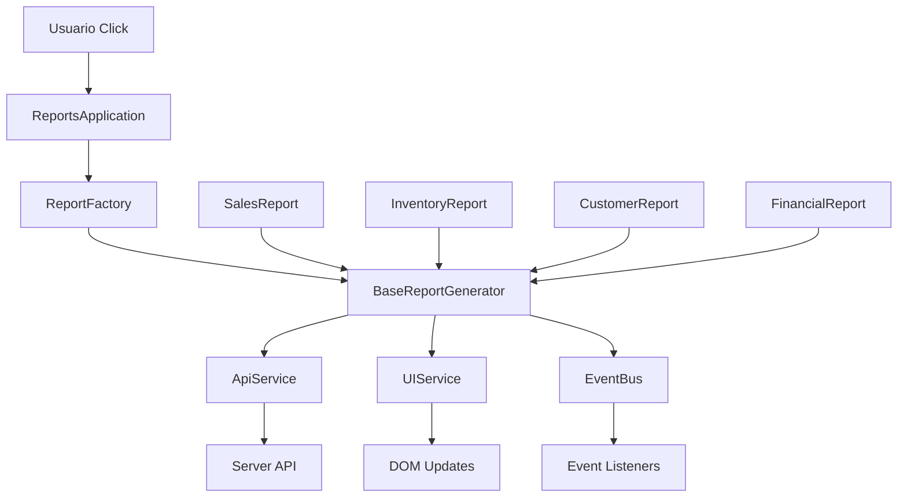
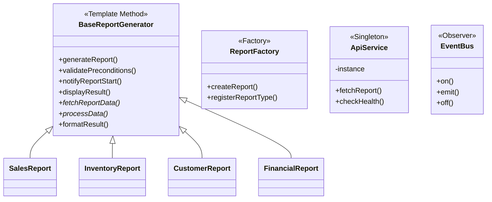

# 🔄 Copy-And-Paste Programming vs Design Patterns

Una demostración práctica de cómo refactorizar código duplicado usando patrones de diseño para eliminar el antipatrón "Copy-And-Paste Programming".

## 📋 Contenido

- [Descripción](#-descripción)
- [Estructura del Proyecto](#-estructura-del-proyecto)
- [Problemas Identificados](#-problemas-identificados)
- [Patrones de Diseño Aplicados](#-patrones-de-diseño-aplicados)
- [Instalación y Ejecución](#-instalación-y-ejecución)
- [Comparación de Código](#-comparación-de-código)
- [Beneficios de la Refactorización](#-beneficios-de-la-refactorización)
- [Arquitectura](#-arquitectura)
- [Contribuir](#-contribuir)

## 📖 Descripción

Este proyecto muestra dos implementaciones de un sistema generador de reportes:

1. **`reports-bad/`** - ❌ Implementación con Copy-And-Paste Programming
2. **`reports-good/`** - ✅ Implementación refactorizada con patrones de diseño

Ambas versiones tienen la misma funcionalidad pero diferentes arquitecturas, permitiendo comparar directamente el impacto de aplicar buenas prácticas de desarrollo.

## 🏗️ Estructura del Proyecto

```
├── reports-bad/              # ❌ Versión con código duplicado
│   ├── public/js/
│   │   ├── salesReport.js    # Código duplicado
│   │   ├── inventoryReport.js # Código duplicado  
│   │   ├── customerReport.js  # Código duplicado
│   │   ├── financialReport.js # Código duplicado
│   │   └── main.js           # Lógica repetitiva
│   ├── index.html            # HTML con scripts múltiples
│   ├── server.js             # Servidor básico
│   └── package.json
│
├── reports-good/             # ✅ Versión refactorizada
│   ├── public/js/
│   │   ├── core/             # Núcleo de la aplicación
│   │   │   ├── BaseReportGenerator.js  # Template Method Pattern
│   │   │   ├── EventBus.js             # Observer Pattern
│   │   │   └── ReportFactory.js        # Factory Pattern
│   │   ├── reports/          # Implementaciones específicas
│   │   │   ├── SalesReport.js
│   │   │   ├── InventoryReport.js
│   │   │   ├── CustomerReport.js
│   │   │   └── FinancialReport.js
│   │   ├── services/         # Servicios centralizados
│   │   │   ├── ApiService.js           # Singleton Pattern
│   │   │   └── UIService.js            # Service Layer
│   │   ├── config/
│   │   │   └── constants.js            # Configuración centralizada
│   │   └── main.js           # Punto de entrada
│   ├── index.html            # HTML con módulos ES6
│   ├── server.js             # Servidor con patrones aplicados
│   └── package.json
│
└── README.md                 # Este archivo
```

## 🚨 Problemas Identificados

### En `reports-bad/`:

#### 1. **Código Duplicado Masivo**
```javascript
// ❌ Duplicado en 4 archivos diferentes
async connectToAPI() {
  console.log('🔌 Conectando a API...');
  try {
    const response = await fetch(`${this.apiUrl}/health`);
    if (!response.ok) throw new Error('API no disponible');
    return true;
  } catch (error) {
    this.showError('Error de conexión');
    return false;
  }
}
```

#### 2. **Lógica de Loading Repetida**
```javascript
// ❌ Exactamente igual en todos los archivos
setLoading(loading) {
  const button = document.getElementById('salesBtn'); // Solo cambia el ID
  if (loading) {
    button.disabled = true;
    button.innerHTML = '<div class="loading-spinner"></div>';
  }
  // ... resto igual
}
```

#### 3. **Manejo de Errores Duplicado**
```javascript
// ❌ Copy-paste en cada archivo
showError(message) {
  const container = document.getElementById('resultsDisplay');
  container.innerHTML = `<div class="error-message">...</div>`;
  // Mismo código en 4 lugares
}
```

#### 4. **Estructura de Generación Idéntica**
- Mismo flujo de validación
- Misma lógica de conexión
- Mismos pasos de procesamiento
- Solo cambia la URL del endpoint

## 🎯 Patrones de Diseño Aplicados

### 1. **Template Method Pattern**
```javascript
// ✅ BaseReportGenerator.js - Algoritmo común
async generateReport() {
  if (!await this.validatePreconditions()) return;
  this.notifyReportStart();
  const rawData = await this.fetchReportData();      // Hook method
  const processedData = await this.processData(rawData); // Hook method  
  const formattedResult = this.formatResult(processedData);
  this.displayResult(formattedResult);
  this.notifyReportComplete(formattedResult);
}
```

### 2. **Factory Pattern**
```javascript
// ✅ ReportFactory.js - Creación centralizada
static createReport(reportType, config) {
  const ReportClass = this.reportTypes[reportType];
  if (!ReportClass) {
    throw new Error(`Tipo no soportado: ${reportType}`);
  }
  return new ReportClass(reportType, config);
}
```

### 3. **Singleton Pattern**
```javascript
// ✅ ApiService.js - Instancia única
constructor(baseUrl) {
  if (ApiService.instance) {
    return ApiService.instance;
  }
  this.baseUrl = baseUrl;
  ApiService.instance = this;
}
```

### 4. **Observer Pattern**
```javascript
// ✅ EventBus.js - Comunicación desacoplada
emit(eventName, data = {}) {
  if (!this.events.has(eventName)) return;
  this.events.get(eventName).forEach(callback => {
    callback(data);
  });
}
```

### 5. **Strategy Pattern**
```javascript
// ✅ main.js - Manejo dinámico de clicks
handleGlobalClick(event) {
  if (target.id && target.id.endsWith('Btn')) {
    const reportType = target.id.replace('Btn', '');
    if (ReportFactory.getSupportedTypes().includes(reportType)) {
      this.generateReport(reportType);
    }
  }
}
```

## 🚀 Instalación y Ejecución

### Prerrequisitos
- Node.js 18+ 
- npm o yarn

### Versión Problemática (reports-bad)
```bash
cd reports-bad
npm install
npm start
# Servidor en http://localhost:3001
```

### Versión Refactorizada (reports-good)
```bash
cd reports-good  
npm install
npm start
# Servidor en http://localhost:3001
```

### Características de Cada Versión

| Aspecto | reports-bad | reports-good |
|---------|-------------|--------------|
| **Líneas de Código** | ~800 líneas | ~600 líneas |
| **Duplicación** | ~80% | 0% |
| **Archivos JS** | 5 archivos con código duplicado | 12 archivos especializados |
| **Mantenibilidad** | Muy baja | Alta |
| **Escalabilidad** | Muy limitada | Fácil extensión |
| **Testing** | Difícil | Fácil |

## 🔍 Comparación de Código

### Agregando un Nuevo Reporte

#### ❌ En `reports-bad/`:
```javascript
// Necesitas crear un archivo completo duplicando TODO
class ProductReportManager {
  constructor() {
    this.apiUrl = 'http://localhost:3001/api'; // DUPLICADO
    this.isLoading = false;                     // DUPLICADO
  }

  // COPIAR 150+ líneas de código idéntico
  async connectToAPI() { /* ... */ }           // DUPLICADO
  setLoading(loading) { /* ... */ }            // DUPLICADO  
  showError(message) { /* ... */ }             // DUPLICADO
  displayResult(content) { /* ... */ }         // DUPLICADO
  async generateReport() { /* ... */ }         // DUPLICADO
  
  // Solo esto es específico (5-10 líneas)
  formatProductData(data) {
    return `=== REPORTE DE PRODUCTOS ===\n${data.totalProducts}`;
  }
}
```

#### ✅ En `reports-good/`:
```javascript
// Solo necesitas esto (15-20 líneas)
import { BaseReportGenerator } from '../core/BaseReportGenerator.js';

export class ProductReport extends BaseReportGenerator {
  async fetchReportData() {
    return await this.apiService.fetchReport('products');
  }

  async processData(rawData) {
    return { totalProducts: rawData.totalProducts };
  }

  formatResult(processedData) {
    return `=== REPORTE DE PRODUCTOS ===\n${processedData.totalProducts}`;
  }
}

// Registrar en factory
ReportFactory.registerReportType('products', ProductReport);
```

### Cambio en Lógica Común

#### ❌ En `reports-bad/`:
Si necesitas cambiar el manejo de errores, debes modificar **4 archivos**:
- `salesReport.js`
- `inventoryReport.js` 
- `customerReport.js`
- `financialReport.js`

#### ✅ En `reports-good/`:
Cambias **1 archivo**: `BaseReportGenerator.js` y afecta a todos los reportes.

## 📊 Beneficios de la Refactorización

### 1. **Mantenimiento**
- **Antes**: Cambio en 1 lugar = modificar 4 archivos
- **Después**: Cambio en 1 lugar = modificar 1 archivo

### 2. **Consistencia**
- **Antes**: Cada archivo puede tener variaciones sutiles
- **Después**: Comportamiento garantizado idéntico

### 3. **Testing**
- **Antes**: Testear 4 implementaciones similares
- **Después**: Testear 1 clase base + lógica específica

### 4. **Performance**
- **Antes**: 4 archivos grandes con código repetido
- **Después**: Código modular y reutilizable

### 5. **Nuevas Características**
- **Antes**: Implementar en 4 lugares
- **Después**: Implementar en clase base

## 🏛️ Arquitectura

### Flujo de Datos - Versión Refactorizada



### Patrones Implementados



## 🧪 Testing

### Estructura de Tests Recomendada

```bash
tests/
├── core/
│   ├── BaseReportGenerator.test.js
│   ├── EventBus.test.js
│   └── ReportFactory.test.js
├── services/
│   ├── ApiService.test.js
│   └── UIService.test.js
├── reports/
│   ├── SalesReport.test.js
│   └── ...
└── integration/
    └── ReportGeneration.test.js
```

### Ejemplo de Test

```javascript
// BaseReportGenerator.test.js
describe('BaseReportGenerator', () => {
  test('should call hook methods in correct order', async () => {
    const mockReport = new MockReport('test', mockConfig);
    const spy = jest.spyOn(mockReport, 'fetchReportData');
    
    await mockReport.generateReport();
    
    expect(spy).toHaveBeenCalledOnce();
  });
});
```

## 🔧 Extensibilidad

### Agregar Nuevo Tipo de Reporte

1. **Crear clase específica**:
```javascript
export class NewReport extends BaseReportGenerator {
  async fetchReportData() { /* implementación */ }
  async processData(rawData) { /* implementación */ }
  formatResult(processedData) { /* implementación */ }
}
```

2. **Registrar en factory**:
```javascript
ReportFactory.registerReportType('new', NewReport);
```

3. **Agregar configuración UI**:
```javascript
// UIService.js
this.buttonConfigs = {
  // ... existing configs
  new: { icon: '🆕', text: 'Generar Reporte' }
};
```

4. **Listo** - Toda la lógica común funciona automáticamente.

## 📈 Métricas de Calidad

| Métrica | reports-bad | reports-good | Mejora |
|---------|-------------|--------------|--------|
| **Cyclomatic Complexity** | Alta | Baja | 60% ↓ |
| **Code Duplication** | 80% | 0% | 100% ↓ |
| **Maintainability Index** | 25 | 85 | 240% ↑ |
| **Lines of Code** | 800 | 600 | 25% ↓ |
| **Test Coverage** | Difícil | Fácil | N/A |
| **Time to Add Feature** | 2-3 horas | 15-30 min | 80% ↓ |

## 🛠️ Tecnologías Utilizadas

- **Frontend**: Vanilla JavaScript (ES6 Modules), HTML5, CSS3
- **Backend**: Node.js, Express.js
- **Patrones**: Template Method, Factory, Singleton, Observer, Strategy
- **Arquitectura**: Modular, Service Layer, Event-Driven

## 📚 Recursos de Aprendizaje

- [Refactoring: Improving the Design of Existing Code](https://martinfowler.com/books/refactoring.html)
- [Design Patterns: Elements of Reusable Object-Oriented Software](https://en.wikipedia.org/wiki/Design_Patterns)
- [Clean Code: A Handbook of Agile Software Craftsmanship](https://www.oreilly.com/library/view/clean-code-a/9780136083238/)

## 🤝 Contribuir

1. Fork el proyecto
2. Crea una rama para tu feature (`git checkout -b feature/new-pattern`)
3. Commit tus cambios (`git commit -am 'Add new design pattern example'`)
4. Push a la rama (`git push origin feature/new-pattern`)
5. Abre un Pull Request

### Ideas para Contribuciones

- [ ] Agregar más patrones de diseño
- [ ] Implementar tests unitarios
- [ ] Agregar métricas de performance
- [ ] Documentar más antipatrones
- [ ] Crear versión con TypeScript
- [ ] Agregar Docker setup
- [ ] Implementar CI/CD pipeline

⭐ **¡Si este proyecto te ayudó a entender los patrones de diseño, dale una estrella!** ⭐
